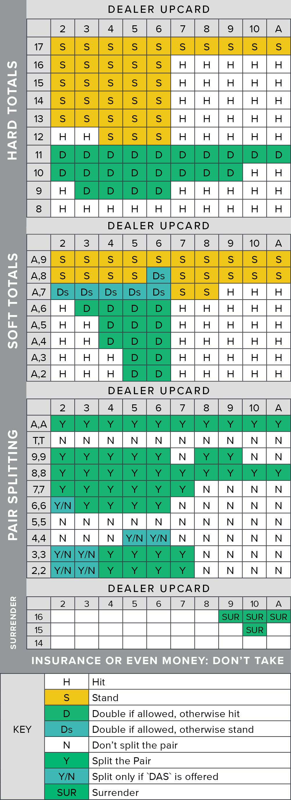

# Blackjack-Trainer
Allows you to train skills for black jack: Basic strategy and Hi-Lo counting

## Basic Strategy

 *source: https://www.blackjackapprenticeship.com/blackjack-strategy-charts/*

Basic strategy aims to allow the player to decide how to play their hand (Hit, Stand, Double, etc.)
This trainer helps players master basic strategy by practicing matching the corresponding plays given the dealer and their hand. 
Note: you are not allowed to surrender

Below are the corresponding commands for each play:

    Hit: h
    Stand: s
    Double/or hit: dh
    Double/or stand: ds
    Split: p
    Quit: q or quit

    

## Hi-Lo Counting
Coming soon

